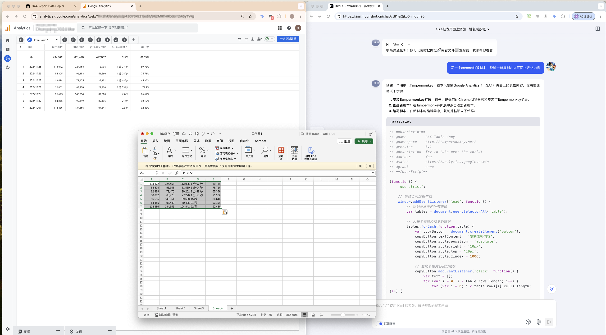

# tampermonkey-jstools
油猴/篡改猴小工具集合

## 简介
这是一个油猴脚本(Tampermonkey UserScript)集合项目，提供各种实用的浏览器扩展功能。

## 使用方法
1. 首先需要安装 [Tampermonkey](https://www.tampermonkey.net/) 浏览器扩展
2. 点击需要安装的脚本链接，即可自动安装

## 脚本列表

### 脚本1
- **功能描述**: 描述脚本1的功能。
- **文件夹**: `scripts/script1/`
- 

### 脚本2
- **功能描述**: 描述脚本2的功能。
- **文件夹**: `scripts/script2/`
- 

### GA4-Report-Data Copier
- **功能描述**: 该脚本用于复制GA4报告数据，方便数据分析和处理。
- **文件夹**: `scripts/GA4-Report-Data-Copier/`
- 

```javascript
// 示例代码片段
// 这里展示GA4-Report-Data Copier.user.js中的部分代码
function copyGA4Data() {
    // 复制数据的逻辑
}
```

<!-- 添加更多脚本时，按照上述格式添加 -->

## 贡献
欢迎提交 Pull Request 或创建 Issue 来帮助改进这个项目。

## 许可证
[选择一个许可证，例如 MIT]
